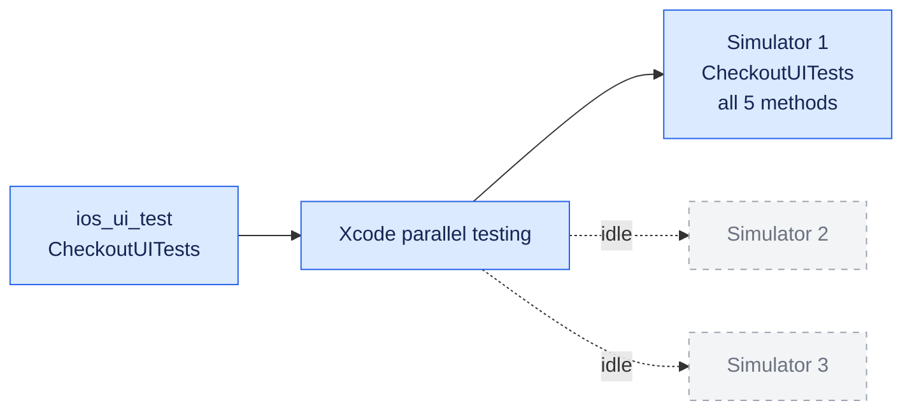
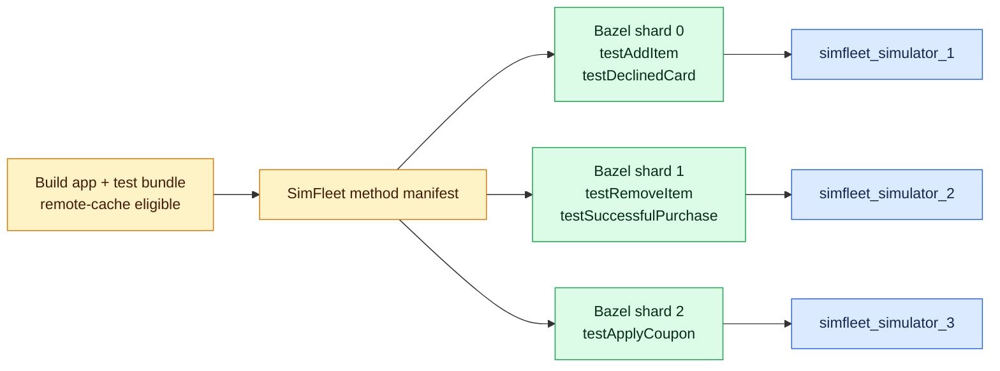
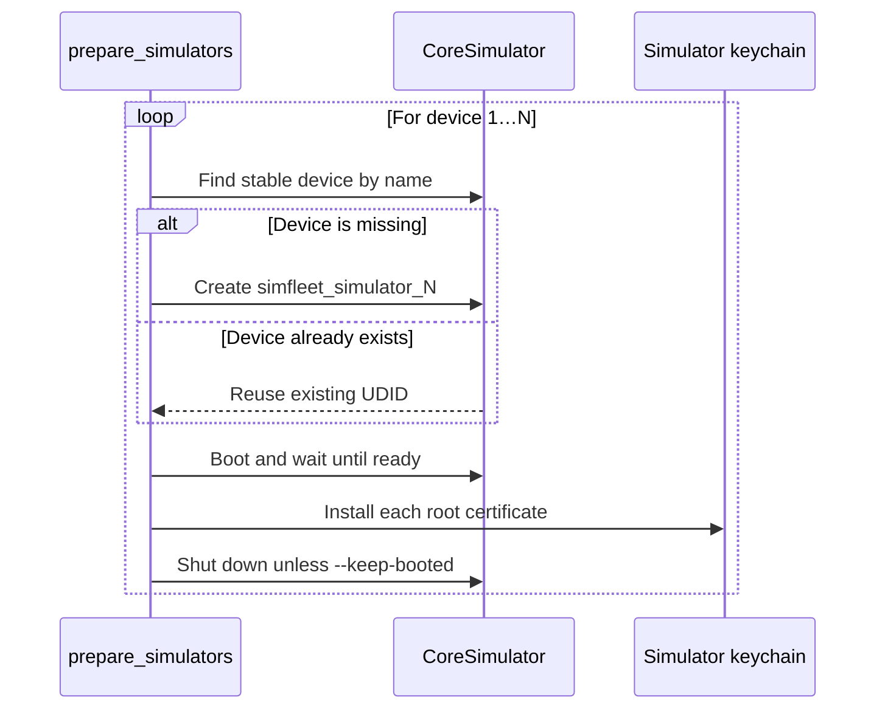
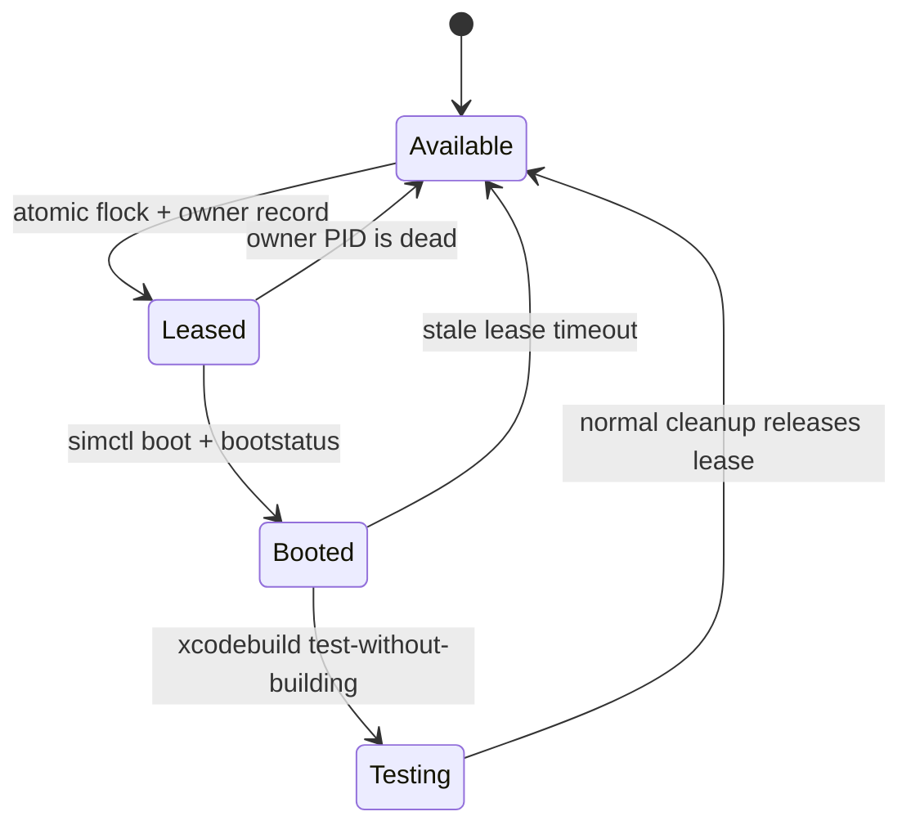
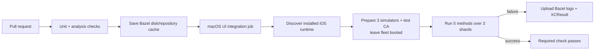

# rules_simfleet

**True method-level iOS UI test parallelism for Bazel—on simulators you own.**

[](https://bazel.build/)
[](https://github.com/bazelbuild/rules_apple)

[](LICENSE)

[Quick start](#quick-start) · [Prepared pools](#prepared-simulator-pools) ·
[Reliability](#robust-concurrent-leasing) · [GitHub Actions](#github-actions) ·
[Architecture](docs/design.md)

`rules_simfleet` is a companion to
[`rules_apple`](https://github.com/bazelbuild/rules_apple) for teams that build
with a remote cache but execute UI tests on local macOS machines. It can split
methods from the same `XCTestCase` across several simulators, manage a stable
pool of preconfigured devices, and prevent concurrent Bazel actions from
claiming the same simulator.

```text
One XCTestCase · Five test methods · Three simulators · One Bazel target
```

## The problem

Xcode's native parallel runner is useful when a bundle has many independent
test classes. A bundle containing one large UI test class can still leave most
simulators idle.



Setting Bazel's `shard_count = 3` directly does not fix this in
`rules_apple`: the default runner does not partition the test list by
`TEST_SHARD_INDEX`, so each shard can run the entire suite.

## What SimFleet changes

SimFleet creates a static method manifest, enables real Bazel sharding, and
turns each shard index into an exact `TESTBRIDGE_TEST_ONLY` filter before the
upstream `ios_xctestrun_runner` starts.



For five methods and three simulators, stable round-robin assignment produces:

| Simulator | Exact XCTest filter |
| --- | --- |
| `simfleet_simulator_1` | `testAddItem`, `testDeclinedCard` |
| `simfleet_simulator_2` | `testRemoveItem`, `testSuccessfulPurchase` |
| `simfleet_simulator_3` | `testApplyCoupon` |

All three rows execute concurrently even though every method belongs to the
same class.

## Why use it

| Capability | Native Xcode distribution | Naive Bazel `shard_count` | SimFleet method sharding |
| --- | --- | --- | --- |
| Parallelizes one large test class | Limited | No—repeats the suite | Yes—exact method filters |
| Builds one app/test bundle graph | Yes | Yes | Yes |
| Works with Bazel remote cache | Yes | Yes | Yes |
| Prevents simulator oversubscription | Outside Bazel's view | No | Bazel custom resources |
| Supports persistent certificate-ready devices | No first-class pool | No | Yes |
| Avoids two actions sharing one device | Xcode-managed clones | Not guaranteed | Atomic per-UDID leases |
| Recovers after cancellation | Xcode-managed | Runner-dependent | Dead-owner lease reclamation |

SimFleet stays deliberately small: `rules_apple` still builds the bundles,
creates the `.xctestrun`, launches `xcodebuild`, and processes the result. This
project only adds scheduling, filtering, resource accounting, and prepared
device lifecycle policy.

## Quick start

### 1. Add the module

Until the module is published, point Bzlmod at a local checkout:

```starlark
bazel_dep(name = "rules_apple", version = "5.0.0-rc2")
bazel_dep(name = "rules_simfleet", version = "0.1.0")

local_path_override(
    module_name = "rules_simfleet",
    path = "../rules_simfleet",
)
```

### 2. Declare every UI test method

```starlark
load("@rules_simfleet//simfleet:defs.bzl", "ios_method_sharded_ui_test")

ios_method_sharded_ui_test(
    name = "CheckoutUITests",
    test_identifiers = [
        "CheckoutUITests/testAddItem",
        "CheckoutUITests/testRemoveItem",
        "CheckoutUITests/testApplyCoupon",
        "CheckoutUITests/testDeclinedCard",
        "CheckoutUITests/testSuccessfulPurchase",
    ],
    simulator_count = 3,
    minimum_os_version = "18.0",
    test_host = ":CheckoutApp",
    deps = [":CheckoutUITestsLib"],
)
```

The manifest is authoritative. A method omitted from `test_identifiers` is not
run. SimFleet owns `test_filter`, `runner`, and `shard_count`, so callers must
not set those separately.

### 3. Give Bazel simulator capacity

Each method shard requests one `ios_simulator` resource. Configure the total
capacity of the machine in `.bazelrc`:

```bazelrc
build --local_resources=ios_simulator=3
```

This is a `build` option because tags can propagate to generated Apple bundle
actions as well as the final test action.

### 4. Run the target

```shell
bazel test //app:CheckoutUITests --cache_test_results=yes
```

With a remote cache hit, Bazel can reuse compilation and bundle assembly. Test
execution remains local because SimFleet adds `no-remote-exec`, without adding
the stronger `local` requirement that would disable caching.

## Prepared simulator pools

Temporary simulators are a poor fit for corporate proxies, private certificate
authorities, MDM-like setup, or expensive one-time device configuration.
Prepare stable devices once and reuse them across test runs:

```shell
bazel run @rules_simfleet//simfleet:prepare_simulators -- \
  --pool corporate-proxy \
  --count 3 \
  --device-type "iPhone 16 Pro" \
  --os-version 18.2 \
  --developer-dir /Applications/Xcode.app/Contents/Developer \
  --certificate "$HOME/certs/corporate-proxy-root.pem"
```

`--certificate` may be repeated. Preparation creates or reuses
`simfleet_simulator_1`, `simfleet_simulator_2`, and so on, boots each device,
installs the roots with `simctl keychain add-root-cert`, and shuts it down
unless `--keep-booted` is set. It never implicitly erases or deletes a device.



Select the pool from the test target:

```starlark
ios_method_sharded_ui_test(
    name = "CheckoutUITests",
    test_identifiers = CHECKOUT_UI_TESTS,
    simulator_count = 3,
    prepared_simulator_pool = "corporate-proxy",
    minimum_os_version = "18.0",
    test_host = ":CheckoutApp",
    deps = [":CheckoutUITestsLib"],
)
```

The device type and OS can be set on the macro or supplied dynamically through
the standard `rules_apple` build settings:

```shell
bazel test //app:CheckoutUITests \
  --@rules_apple//apple/build_settings:ios_simulator_device="iPhone 16" \
  --@rules_apple//apple/build_settings:ios_simulator_version="18.5"
```

Certificate installation establishes trust. Configuring the host proxy or the
simulator's network route remains environment-specific.

## Robust concurrent leasing

Every shard acquires an atomic, machine-wide lease before booting a prepared
device. Cleanup releases the lease but preserves the simulator and its
keychain.



Leases are global per UDID, not merely per logical pool name. A second Bazel
process therefore cannot take the same simulator through a differently named
pool. Owner records use the parent test-runner PID, allowing abandoned leases
to be reclaimed after cancellations or crashes.

## Balancing slow methods

Without timing data, assignment is deterministic round-robin. With
`estimated_durations`, SimFleet schedules the longest methods first onto the
currently lightest shard:

```starlark
ios_method_sharded_ui_test(
    name = "CheckoutUITests",
    test_identifiers = CHECKOUT_UI_TESTS,
    simulator_count = 3,
    estimated_durations = {
        "CheckoutUITests/testApplyCoupon": 18,
        "CheckoutUITests/testDeclinedCard": 7,
        "CheckoutUITests/testSuccessfulPurchase": 24,
    },
    create_xcresult_bundle = True,
    minimum_os_version = "18.0",
    test_host = ":CheckoutApp",
    deps = [":CheckoutUITestsLib"],
)
```

Unlisted methods receive an estimate of zero. Estimates only affect placement;
they are not timeouts.

## Two execution modes

| Mode | Macro | Best for |
| --- | --- | --- |
| Method-sharded | `ios_method_sharded_ui_test` | One or a few large test classes; exact Bazel-visible partitions |
| Xcode-managed | `ios_parallel_ui_test` | Many independent classes; Xcode-managed clone lifecycle |

Method-sharded mode uses unique temporary devices when no prepared pool is
selected. The upstream `rules_apple` cleanup removes those devices. Prepared
mode instead leases stable devices and preserves their state.

## GitHub Actions

The checked-in [CI workflow](.github/workflows/ci.yml) runs on pull requests,
pushes to `main`, and manual dispatches:



No repository secret is required, so forked pull requests can run the checks.
The UI job restores the cache produced by the unit job, while simulator
execution stays local to its Mac runner.

The CI preparation step uses `--keep-booted`. Fresh GitHub runners otherwise
boot every simulator to install the test certificate, shut each one down, and
immediately cold-boot the whole fleet again inside the Bazel shards. Avoiding
that redundant cycle is important for modern iOS runtimes on hosted Macs.

CI also opts into local spawn and test strategies through `--config=ci`:

```bazelrc
build:ci --spawn_strategy=local
test:ci --test_strategy=standalone
```

This avoids the high `sandbox-exec` overhead of Xcode and CoreSimulator on
hosted macOS while leaving sandboxing enabled for normal developer builds.

The default label is `macos-15`. To use a larger or self-hosted machine, create
the repository Actions variable `SIMFLEET_MACOS_RUNNER` with the desired runner
label. For four or five concurrent simulators, a larger runner is strongly
recommended.

## Guarantees and boundaries

- Exactly the declared method identifiers are distributed.
- A shard never silently runs the full suite.
- Simulator demand is visible to Bazel's local resource manager.
- Prepared devices are never implicitly erased or deleted.
- Stale leases are recoverable after terminated test runners.
- All shards use the same device type and iOS runtime.
- Application data persists on prepared devices; tests remain responsible for
  resetting their own state.

See [the architecture and design notes](docs/design.md) for runner composition,
cache boundaries, lease ownership, failure behavior, and rejected alternatives.
