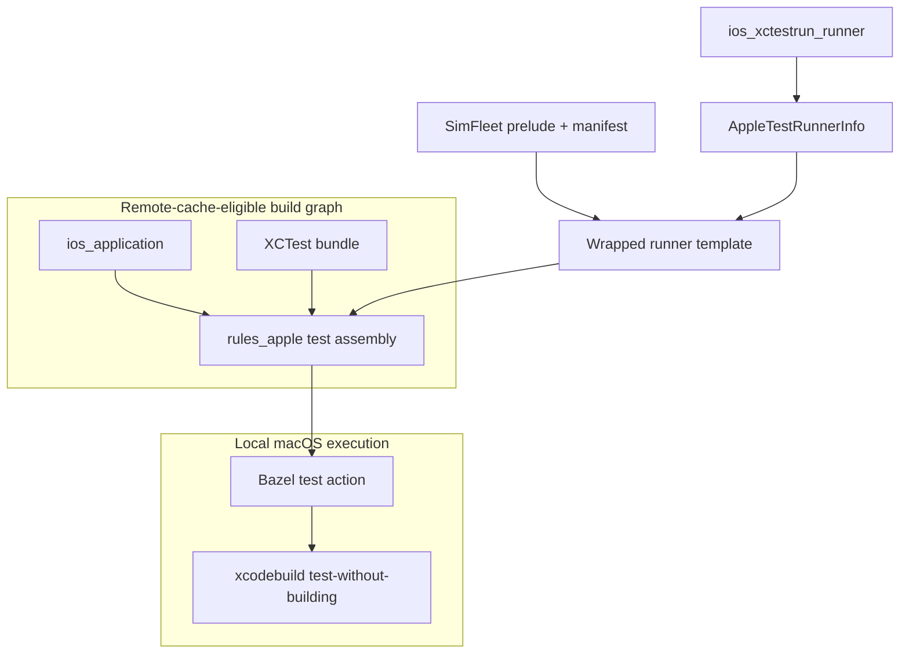
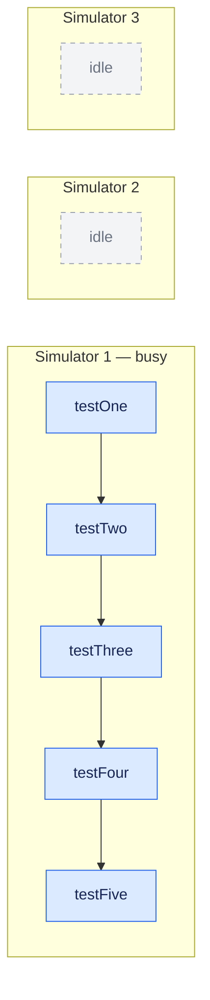
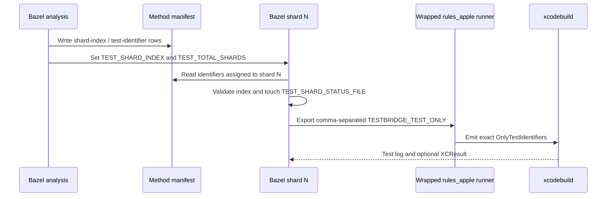
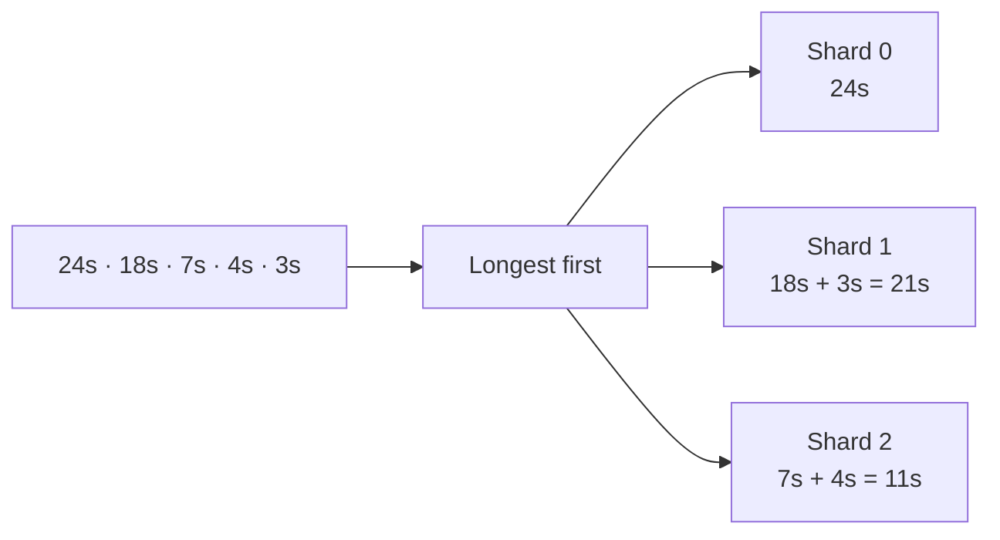
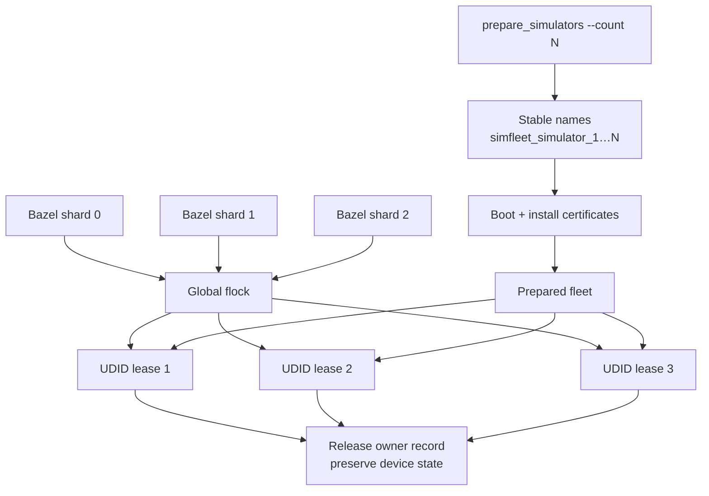
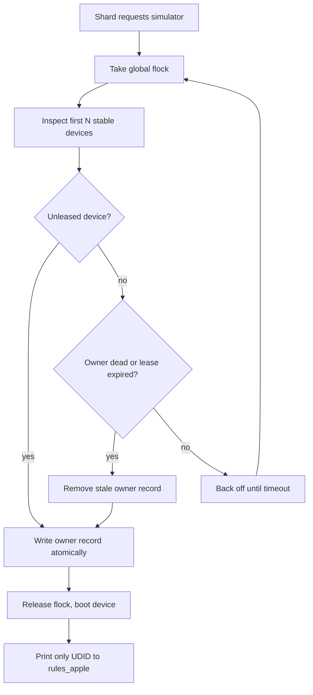
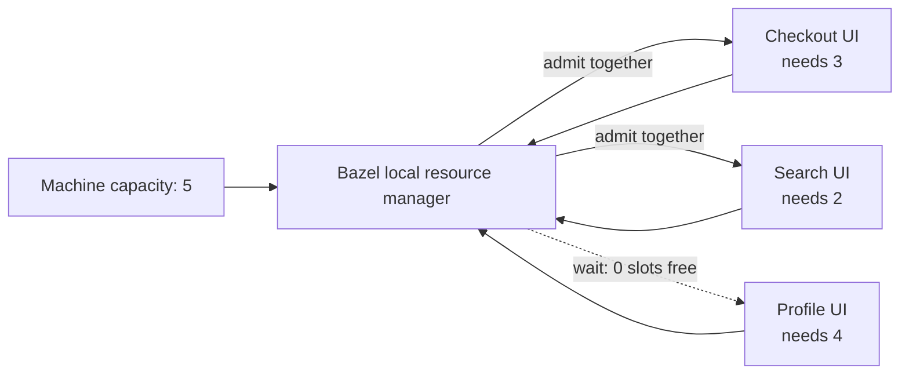
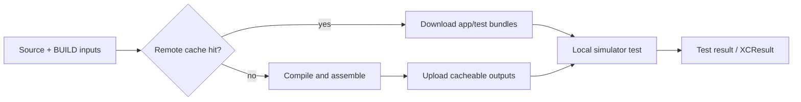

# Architecture and design

This document explains why SimFleet is implemented as a thin runner layer over
`rules_apple`, how method sharding remains deterministic, and which failure
modes the simulator pool is designed to contain.

## Design goals

1. Parallelize individual UI test methods, including methods from one
   `XCTestCase`.
2. Preserve Bazel remote-cache eligibility while keeping CoreSimulator work on
   the local Mac.
3. Support persistent simulators with preinstalled corporate or proxy root
   certificates.
4. Prevent simulator collisions across targets and concurrent Bazel commands.
5. Reuse `rules_apple` bundle assembly and xctestrun behavior instead of
   maintaining a fork.

## The `rules_apple` extension seam

`ios_ui_test` assembles the app, UI test bundle, `.xctestrun`, and executable
test action. Its runner arrives through `AppleTestRunnerInfo`, allowing
SimFleet to wrap the test-runner template without changing Apple bundle rules.



The upstream runner already knows how to:

- create an `.xctestrun` file;
- select a simulator destination;
- translate `TESTBRIDGE_TEST_ONLY` into `OnlyTestIdentifiers`;
- invoke `xcodebuild test-without-building` for a hosted UI test;
- collect logs and XCResult output; and
- run custom simulator creation and cleanup executables.

SimFleet composes those public mechanisms rather than reimplementing them.

## Why the obvious approaches fall short

### Native Xcode parallel testing

Xcode owns worker clones, scheduling, aggregation, and teardown, which makes it
an excellent default for bundles with many independent classes. Its useful
distribution unit is too coarse when most work lives in a single class.



SimFleet retains an `ios_parallel_ui_test` mode for the workloads where native
class distribution is the right tradeoff.

### Setting `shard_count` directly

Bazel exports `TEST_SHARD_INDEX` and `TEST_TOTAL_SHARDS`, but a runner must use
them to select different work. The standard `rules_apple` runner does not do
that partitioning. Three shards can therefore become three complete test-suite
executions rather than three partitions.

### Declaring one target per method

This produces independent test actions, but multiplies BUILD declarations,
test targets, result bundles, and maintenance. It also makes method discovery
and timing policy the consuming application's responsibility. SimFleet keeps
one public test target and generates the partitions internally.

## Method-sharding data flow

At analysis time, SimFleet validates the complete list of `Class/testMethod`
identifiers and assigns each one to a shard. At execution time, each Bazel
shard reads the same manifest but selects only its own rows.



The wrapper fails closed when:

- the shard count differs from the declared simulator count;
- the shard index is missing or invalid;
- no method is assigned to a shard; or
- a caller also supplies a command-line `--test_filter`.

That validation prevents a configuration mistake from silently running every
method on every simulator.

## Scheduling and balancing

Without estimates, method assignment is stable round-robin. This makes changes
reviewable and keeps shard identities deterministic:

```text
method 0 -> shard 0
method 1 -> shard 1
method 2 -> shard 2
method 3 -> shard 0
method 4 -> shard 1
```

When `estimated_durations` is present, SimFleet uses longest-processing-time
scheduling: sort from longest to shortest, then place the next method on the
currently lightest shard.



Estimates influence placement only. They do not change XCTest timeouts and do
not need to be exact to improve a badly skewed suite.

## Simulator lifecycle modes

### Ephemeral mode

Without `prepared_simulator_pool`, SimFleet disables simulator reuse on the
base runner. Concurrent Bazel shards then receive randomized device names from
the upstream creator and `rules_apple` deletes them during cleanup.

This is the lowest-maintenance option when tests need no persistent keychain or
device configuration.

### Prepared mode

Prepared mode swaps in SimFleet's acquire and release executables. The devices
are long-lived; only lease ownership is temporary.



Preparation is intentionally non-destructive. If an existing stable device has
the wrong device type, preparation stops and asks the operator to resolve it;
it does not erase, replace, or delete the device automatically.

## Lease correctness

The lease root is machine-local under `/private/tmp/rules_simfleet/<uid>` by
default. A global `flock` serializes selection and owner-record updates.

Each owner record identifies the upstream test-runner parent PID. A lease is
considered stale when the owner process no longer exists or the configured
maximum age is exceeded. This covers normal completion, Bazel cancellation,
runner crashes, and most abrupt process termination.



Leases are keyed by UDID rather than pool name. Two logical pools cannot
concurrently select the same physical simulator.

## Resource accounting

CoreSimulator capacity is finite, but internal Xcode workers are invisible to
Bazel unless the test declares demand. SimFleet adds a custom execution tag:

```text
resources:ios_simulator:1
```

to each method-sharded test action, or `resources:ios_simulator:N` to an
Xcode-managed target with `N` workers. The machine declares its total capacity:

```bazelrc
build --local_resources=ios_simulator=5
```



This prevents unrelated test targets or concurrent builds from accidentally
booting more simulators than the Mac can sustain.

## Remote-cache boundary

CoreSimulator cannot run on a generic non-macOS worker, and prepared devices
exist only on one host. SimFleet therefore marks tests `no-remote-exec`.



The macro deliberately avoids Bazel's `local` test attribute because that
execution requirement also makes the spawn ineligible for caching. With
`--cache_test_results=yes`, a successful shard may itself be served from cache
when its complete action key and declared environment are unchanged.

## Failure behavior

| Failure | Behavior |
| --- | --- |
| Missing method assignment | Shard fails before launching Xcode |
| Invalid shard environment | Shard fails closed with a diagnostic |
| Pool exhausted | Acquire retries until its timeout |
| Bazel process is killed | Dead-owner lease is reclaimed later |
| Certificate path is missing | Preparation fails before modifying devices |
| Stable name has the wrong device type | Preparation stops without deleting it |
| Test fails | Cleanup releases the lease; logs/XCResult remain available |
| Two Bazel commands race | Global lock and per-UDID records serialize claims |

Prepared devices intentionally retain application and keychain state. Test
code must reset application-specific state; SimFleet does not erase a device
as an implicit cleanup strategy.

## Constraints

- The explicit method manifest is authoritative and currently maintained by
  the target author.
- Every shard in one target uses the same device type and runtime.
- A device/OS matrix remains a separate test-suite concern.
- `extra_xcodebuild_args` is tokenized; flags and values are separate list
  entries because the upstream runner joins them into its command.
- Four or five simultaneous UI-test simulators generally require more CPU and
  memory than a small hosted macOS runner provides.

## Future work

1. Add `simfleet doctor` to report CPU, memory, runtimes, device types, stale
   leases, and a recommended fleet size.
2. Generate method manifests from XCTest discovery output while preserving a
   reviewable checked-in mode.
3. Learn duration estimates from Build Event Protocol and XCResult history.
4. Add an optional pre-action for deterministic application-data cleanup on
   persistent devices.
5. Upstream a smaller parallel-worker API to `ios_xctestrun_runner` and keep
   SimFleet focused on method sharding and pool management.
